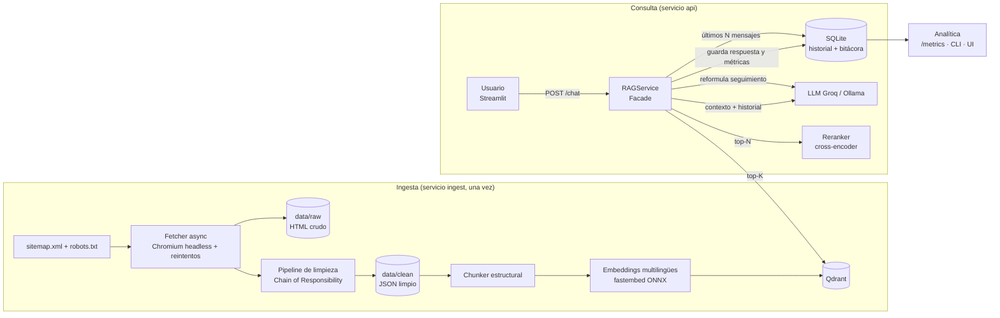

# 🏦 BBVA Colombia RAG Assistant

Asistente conversacional que permite a usuarios internos consultar la información publicada en
[bbva.com.co](https://www.bbva.com.co/) sin búsquedas manuales. Implementa un sistema **RAG
(Retrieval-Augmented Generation)** completo: web scraping → limpieza → chunking → embeddings →
base vectorial → reranking → LLM, con memoria conversacional por sesión y un módulo de analítica
para medir uso, calidad e impacto.

Todo el stack es **gratuito y open source / open-weights**, y se levanta con **un solo comando**.

---

## 📑 Contenido

1. [Arquitectura](#-arquitectura)
2. [Requisitos previos](#-requisitos-previos)
3. [Instalación y ejecución](#-instalación-y-ejecución-con-docker)
4. [Uso de la interfaz](#-uso-de-la-interfaz)
5. [API REST](#-api-rest)
6. [Analítica de conversaciones](#-analítica-de-conversaciones)
7. [Configuración (.env)](#️-configuración-env)
8. [Patrones de diseño](#-patrones-de-diseño)
9. [Stack tecnológico y justificación](#-stack-tecnológico-y-justificación)
10. [Estructura del proyecto](#-estructura-del-proyecto)
11. [Tests y desarrollo local](#-tests-y-desarrollo-local)
12. [Supuestos y decisiones de diseño](#-supuestos-y-decisiones-de-diseño)
13. [Limitaciones conocidas](#️-limitaciones-conocidas)
14. [Futuras mejoras](#-futuras-mejoras)

---

## 🧭 Arquitectura



**Flujo de una pregunta:**

1. Se cargan los últimos `HISTORY_WINDOW_N` mensajes de la sesión (`session_id`).
2. Si hay historial, la pregunta de seguimiento se **reformula** a una consulta autónoma
   (por ejemplo, *"¿y qué requisitos pide?"* se convierte en *"requisitos tarjeta Visa Aqua BBVA"*).
   Así la memoria mejora también la **recuperación**, no solo la generación.
3. Se buscan los `RETRIEVAL_TOP_K` (20) chunks más similares en Qdrant.
4. El **reranker** cross-encoder los reordena y se quedan los `RERANK_TOP_N` (4) mejores.
5. El LLM responde **solo con ese contexto**, citando fuentes `[1]`, `[2]`. Si no hay información,
   responde con una frase fija que permite medir la tasa de "sin respuesta".
6. Se persisten los mensajes y una **bitácora de la interacción** (latencias por etapa, score,
   fuentes, errores y feedback), que alimenta la analítica.

---

## ✅ Requisitos previos

| Requisito | Detalle |
|---|---|
| **Docker** + **Docker Compose v2.24+** | [Docker Desktop](https://www.docker.com/products/docker-desktop/) (Windows/Mac) o Docker Engine (Linux) |
| **API key gratuita de Groq** | Créala en <https://console.groq.com/keys> (no requiere tarjeta) |
| **Espacio en disco** | ~4 GB: imagen con Chromium (~2,4 GB) + embeddings (~0.2 GB) + reranker (~1.1 GB). Con `RERANKER_ENABLED=false` son ~3 GB |
| **Internet** | Para scrapear el sitio, descargar modelos la primera vez y llamar a Groq |

> ¿Prefieres no depender de ninguna API? Puedes usar **Ollama** 100 % local (ver [Configuración](#️-configuración-env)),
> pero necesitas unos 4 GB extra de disco y 8 GB de RAM.

---

## 🚀 Instalación y ejecución con Docker

```bash
# 1. Clonar
git clone https://github.com/Osquitar12/bbva-rag-assistant.git
cd bbva-rag-assistant

# 2. Configurar variables de entorno
cp .env.example .env          # en Windows (PowerShell): copy .env.example .env
#    Edita .env y pega tu clave:  GROQ_API_KEY=gsk_...

# 3. Levantar todo
docker compose up --build
```

**¿Qué ocurre en el primer arranque?** (≈ 40 min en un portátil de 4 núcleos sin GPU; casi todo es el cálculo de embeddings. Con `SCRAPE_MAX_PAGES=300` son ≈ 12 min, solo con las páginas de productos)

1. `qdrant` arranca la base vectorial.
2. `ingest` lee el sitemap, descarga hasta `SCRAPE_MAX_PAGES` páginas (respetando `robots.txt`
   y con pausas entre peticiones), guarda el HTML en `data/raw/`, el texto limpio en `data/clean/`,
   descarga los modelos e indexa los chunks. Al terminar, el contenedor sale con código 0.
3. `api` arranca cuando la ingesta terminó.
4. `ui` arranca cuando la API está sana.

En los **siguientes arranques** la ingesta detecta que ya hay datos y vectores y se salta el trabajo,
así que el sistema queda listo en segundos.

| Servicio | URL |
|---|---|
| 💬 Interfaz de chat (Streamlit) | <http://localhost:8501> |
| 📘 API + documentación Swagger | <http://localhost:8000/docs> |
| 🗄️ Qdrant dashboard | <http://localhost:6333/dashboard> |

**Comandos útiles**

```bash
docker compose logs -f ingest                       # ver progreso del scraping/indexación
docker compose run --rm ingest python -m app.scraper.run --force   # re-scrapear
docker compose run --rm ingest python -m app.ingestion.run --reindex  # reindexar
docker compose exec api python scripts/seed_demo.py               # generar conversaciones demo
docker compose exec api python -m app.analytics.cli               # reporte de métricas
docker compose down            # detener  (añade -v para borrar vectores y caché de modelos)
```

---

## 💬 Uso de la interfaz

1. Abre <http://localhost:8501>.
2. Escribe tu pregunta en la caja de chat. Ejemplos:
   - *¿Qué beneficios tiene la tarjeta Visa Aqua?* → luego *¿y qué requisitos pide?* (prueba de memoria)
   - *¿Qué es un CDT y se puede abrir en línea?*
   - *¿Cómo abro una cuenta de ahorros digital?*
   - *¿Qué hago si me roban el celular?*
3. Cada respuesta muestra sus **fuentes** (enlaces a bbva.com.co) y botones 👍/👎 de feedback.
4. En la barra lateral:
   - Ves el **ID de la sesión** actual.
   - **➕ Nueva conversación** crea un ID nuevo.
   - Puedes **retomar** una conversación anterior desde la lista o pegando su ID. El historial se
     persiste en `data/chat.db`, así que sobrevive a reinicios.
   - El **estado del sistema** muestra el LLM, los vectores indexados y el reranker.
5. La pestaña **📊 Métricas** muestra la analítica del histórico.

---

## 🔌 API REST

| Método | Ruta | Descripción |
|---|---|---|
| `POST` | `/chat` | `{"message": "...", "session_id": "opcional"}`. Si no envías `session_id`, se crea uno nuevo |
| `GET` | `/sessions` | Lista de sesiones (preview y nº de mensajes) |
| `GET` | `/sessions/{id}/history` | Historial completo de una sesión |
| `POST` | `/feedback` | `{"interaction_id": 12, "value": 1 \| -1}` |
| `GET` | `/metrics` | Analítica del histórico (JSON) |
| `GET` | `/health` | Estado: vectores indexados, LLM, reranker, errores de arranque |

```bash
curl -s -X POST localhost:8000/chat -H "Content-Type: application/json" \
  -d '{"message": "¿Qué es un CDT?", "session_id": "demo-1"}'

curl -s -X POST localhost:8000/chat -H "Content-Type: application/json" \
  -d '{"message": "¿Y se puede abrir por internet?", "session_id": "demo-1"}'
```

Respuesta:

```json
{
  "session_id": "demo-1",
  "answer": "Sí, puedes abrir un CDT Online desde la app... [1]",
  "answered": true,
  "sources": [{"title": "CDT Online", "url": "https://www.bbva.com.co/personas/productos/inversion/cdt/online.html", "score": 0.91}],
  "rewritten_query": "abrir CDT por internet BBVA",
  "interaction_id": 2,
  "latency_ms": 1840.3
}
```

---

## 📊 Analítica de conversaciones

El módulo `app/analytics` recorre el histórico persistido (tabla `interactions` + `messages`) y
calcula métricas disponibles en tres formatos: **CLI** (`python -m app.analytics.cli [--json]`),
**endpoint** `GET /metrics` y **pestaña Métricas** de la UI.

| Categoría | Métricas | ¿Para qué sirve? |
|---|---|---|
| **Uso** | Sesiones, preguntas, preguntas por sesión, % de preguntas de seguimiento, preguntas por día y hora pico | Adopción y patrones de uso; el % de seguimiento muestra si se aprovecha la memoria |
| **Calidad** | Tasa de respuesta, tasa de "sin respuesta", tasa de error, score medio de relevancia, satisfacción (👍/👎) | Salud del sistema y percepción del usuario |
| **Rendimiento** | Latencia p50/p95 total y por etapa (recuperación vs. generación) | Dónde optimizar |
| **Contenido** | Secciones del sitio y URLs más citadas, términos más frecuentes | Qué productos generan más dudas internas |
| **Brechas** | Lista de preguntas sin respuesta | Oportunidades de contenido para el sitio, o fallos de recuperación |
| **Impacto** | Búsquedas manuales evitadas y **horas ahorradas estimadas** = respuestas útiles × `MINUTES_SAVED_PER_ANSWER` / 60 | Valor de negocio del asistente |

> El supuesto de minutos ahorrados (4 min por defecto) es configurable y debería calibrarse con un
> estudio real del tiempo que toma encontrar la información navegando el sitio.

---

## ⚙️ Configuración (.env)

Todos los parámetros están externalizados (`app/config.py`, con `pydantic-settings`). Los principales:

| Variable | Default | Descripción |
|---|---|---|
| `LLM_PROVIDER` | `groq` | `groq` u `ollama` |
| `GROQ_API_KEY` | — | **Obligatoria** con Groq |
| `LLM_MODEL` | `openai/gpt-oss-120b` | Modelo de respuesta (open-weights) |
| `LLM_REWRITE_MODEL` | `openai/gpt-oss-20b` | Modelo ligero para reformular preguntas |
| `LLM_TEMPERATURE` / `LLM_MAX_TOKENS` | `0.1` / `1500` | Generación |
| `LLM_REASONING_EFFORT` | `low` | Esfuerzo de razonamiento de los modelos gpt-oss |
| `HISTORY_WINDOW_N` | `6` | **N mensajes previos** usados como contexto |
| `QUERY_REWRITE_ENABLED` | `true` | Reformulación de preguntas de seguimiento |
| `SCRAPE_MAX_PAGES` | `1300` | Límite de páginas a scrapear (el sitemap tiene ~1.200 útiles) |
| `SCRAPE_CONCURRENCY` / `SCRAPE_DELAY_SECONDS` | `4` / `0.5` | Cortesía con el servidor |
| `SCRAPE_FETCHER` | `browser` | `browser` = Chromium headless (Playwright), `http` = httpx puro |
| `SCRAPE_PRIORITY_PATTERNS` | `/productos/` | Rutas que se descargan primero cuando el sitemap supera `SCRAPE_MAX_PAGES` |
| `SCRAPE_INCLUDE_PATTERNS` / `SCRAPE_EXCLUDE_PATTERNS` | — / `/investor-relations/,...` | Filtros por ruta |
| `SCRAPE_FORCE` / `REINDEX` | `false` | Forzar re-scraping / reindexación |
| `CHUNK_SIZE` / `CHUNK_OVERLAP` | `1000` / `150` | Chunking (en caracteres) |
| `EMBEDDING_MODEL` | `paraphrase-multilingual-MiniLM-L12-v2` | Modelo de embeddings |
| `RETRIEVAL_TOP_K` / `RERANK_TOP_N` | `20` / `4` | Candidatos y contexto final |
| `RERANKER_ENABLED` / `RERANKER_MODEL` | `true` / `jina-reranker-v2-base-multilingual` | Reranker cross-encoder. Con `false` se usa un reranker léxico ligero (`KeywordReranker`), sin modelo |
| `MIN_RELEVANCE_SCORE` | vacío | Umbral opcional de score |
| `MINUTES_SAVED_PER_ANSWER` | `4` | Supuesto para el cálculo de impacto |

**Modo 100 % local con Ollama**

```bash
# en .env: LLM_PROVIDER=ollama, LLM_MODEL=qwen2.5:3b, LLM_REWRITE_MODEL=qwen2.5:3b
docker compose --profile ollama up --build -d
docker compose exec ollama ollama pull qwen2.5:3b
```

---

## 🧩 Patrones de diseño

| Patrón | Tipo | Dónde | Por qué |
|---|---|---|---|
| **Strategy** | Comportamental | `rag/llm.py` (`LLMProvider` → `GroqLLM`, `OllamaLLM`), `rag/embeddings.py` (`EmbeddingProvider`), `rag/reranker.py` (`Reranker` → `CrossEncoderReranker`, `KeywordReranker`, `NoOpReranker`), `scraper/fetcher.py` (`BrowserFetcher` / `PageFetcher`, elegidos con `create_fetcher`) | Cambiar de proveedor de LLM, embeddings o reranker sin tocar la lógica del RAG. Permite pasar de una API a un modelo local, apagar el reranker si falta disco e inyectar fakes en tests |
| **Factory** | Creacional | `LLMFactory.create()`, `create_embedder()`, `create_reranker()` | Centraliza la construcción de la estrategia correcta según el `.env`. `LLMFactory` tiene registro extensible y `create_reranker` degrada a `KeywordReranker` si el modelo no carga |
| **Repository** | Estructural / acceso a datos | `memory/repository.py` (`ConversationRepository` → `SQLAlchemyConversationRepository`) | El servicio RAG y la analítica no conocen SQL. Migrar de SQLite a Postgres es cambiar `DATABASE_URL`, y a Redis o Mongo, otra implementación |
| **Facade** | Estructural | `rag/service.py` (`RAGService.ask()`) | Oculta la orquestación de historial, reformulación, búsqueda, reranking, LLM y persistencia detrás de un único método. API y UI no dependen de los detalles |
| **Chain of Responsibility** | Comportamental | `scraper/cleaner.py` (`CleaningStep.set_next()`) | La limpieza del HTML es una cadena de pasos independientes (metadatos → boilerplate → contenido → espacios → duplicados). Se pueden añadir o reordenar pasos sin modificar los demás |
| **Singleton** | Creacional | `config.py` (`get_settings()` con `lru_cache`) | Una única configuración compartida y leída una sola vez del entorno |

Además, `build_rag_service()` actúa como **composition root** (inyección de dependencias manual),
lo que hace testeable todo el flujo con fakes.

---

## 🛠 Stack tecnológico y justificación

| Componente | Elección | Justificación |
|---|---|---|
| Lenguaje | **Python 3.12** | Requisito; ecosistema ML |
| Descubrimiento de URLs | **sitemap.xml** + `urllib.robotparser` | El sitio publica un sitemap completo (~700 URLs), así que no hace falta un crawler. Es más rápido y más respetuoso, y aporta `lastmod` |
| Descarga | **Playwright** (Chromium headless) + **tenacity** | El WAF del sitio responde 403 a clientes HTTP que no son un navegador (httpx, curl), así que las páginas se piden con Chromium. Concurrencia limitada con semáforo, pausas entre peticiones y reintentos exponenciales ante 429/5xx. Con `SCRAPE_FETCHER=http` se usa httpx puro |
| Extracción | **trafilatura** + **BeautifulSoup** | trafilatura es muy buena extrayendo el contenido principal de artículos; para páginas de producto basadas en componentes hay un fallback BS4, que también se usa cuando trafilatura pierde los encabezados de sección (años de una línea de tiempo, títulos de acordeones como "Requisitos"). Se conservan los encabezados en Markdown para un chunking estructural |
| Chunking | Propio: **por encabezados + recursivo** | Los chunks respetan secciones como "Beneficios" o "Requisitos", y cada uno lleva título y encabezado para dar contexto al embedding |
| Embeddings | **fastembed** + `paraphrase-multilingual-MiniLM-L12-v2` | **Multilingüe** (el contenido es en español), ligero (220 MB, 384 dim) y en **ONNX sin PyTorch**, lo que ahorra ~2 GB en la imagen |
| Vector DB | **Qdrant** (self-hosted) | Open source, gratis, rápido, con dashboard y filtros por payload. Corre como un servicio más del compose |
| Reranker | **jina-reranker-v2-base-multilingual** (fastembed) | Cross-encoder multilingüe: evalúa la pregunta y el pasaje juntos, más preciso que la similitud de embeddings. Es el único reranker multilingüe disponible en ONNX |
| LLM | **Groq** con `openai/gpt-oss-120b` / `gpt-oss-20b` | Modelos **open-weights** servidos gratis y con baja latencia, sin descargar decenas de GB. `llama-3.3-70b-versatile` fue retirado por Groq en 2026 |
| LLM alternativo | **Ollama** | Opción 100 % local por perfil de docker-compose |
| Historial | **SQLite** + **SQLAlchemy 2** | Persistente, sin servicio extra y suficiente para uso interno. Migrable a Postgres por URL |
| API | **FastAPI** | Validación con Pydantic, documentación OpenAPI automática y testeable |
| UI | **Streamlit** | UI de chat funcional y limpia en pocas líneas, con gráficos nativos para las métricas |
| Config | **pydantic-settings** | `.env` tipado y validado |
| Tests | **pytest** | 39 tests sin red: Qdrant en memoria, SQLite en memoria, `httpx.MockTransport` y embeddings/LLM falsos |

---

## 📁 Estructura del proyecto

```
├── app/
│   ├── config.py              # Settings (.env) – Singleton
│   ├── exceptions.py          # Errores de dominio
│   ├── scraper/               # sitemap, fetcher async, limpieza (cadena), almacenamiento local
│   ├── ingestion/             # chunker estructural + CLI de indexación
│   ├── rag/                   # embeddings, vectorstore, reranker, llm, prompts, service (Facade)
│   ├── memory/                # modelos SQLAlchemy + Repository
│   ├── analytics/             # métricas + CLI
│   ├── api/main.py            # FastAPI
│   └── ui/streamlit_app.py    # Streamlit
├── scripts/seed_demo.py       # conversaciones demo
├── tests/                     # 39 tests (pytest)
├── data/raw/                  # HTML crudo + index.jsonl   (generado)
├── data/clean/                # JSON limpio por página     (generado)
├── Dockerfile · docker-compose.yml · .env.example · requirements.txt
```

---

## 🧪 Tests y desarrollo local

```bash
python -m venv .venv && source .venv/bin/activate      # Windows: .venv\Scripts\activate
pip install -r requirements.txt -r requirements-dev.txt
pytest -q
```

Los tests no necesitan red ni modelos: usan Qdrant en memoria, SQLite en memoria, un
`FakeEmbedder` determinista, un `FakeLLM` y `httpx.MockTransport`.

Para correr sin Docker (con un Qdrant local en `localhost:6333`):

```bash
python -m app.ingestion.run --all
uvicorn app.api.main:app --reload
streamlit run app/ui/streamlit_app.py
```

### 🪟 Notas de ejecución en equipos corporativos Windows (sin Docker)

Si corres el proyecto sin Docker en un equipo Windows con políticas corporativas restrictivas
(Application Control / EDR), pueden aparecer estos obstáculos. **No aplican si usas Docker ni en
equipos personales** — quedan documentados por si alguien reproduce ese entorno específico:

| Problema | Causa | Solución |
|---|---|---|
| **`numpy`/`pandas` no cargan dentro de un `venv` del proyecto** (`ImportError: ... An Application Control policy has blocked this file`) | Políticas corporativas de Application Control (WDAC/EDR) pueden bloquear DLLs nativas ejecutadas desde una carpeta de proyecto recién creada, aunque el mismo paquete sí sea ejecutable desde una ubicación "de confianza" ya usada por el sistema | Instalar las dependencias a nivel de usuario global (`pip install --user -r requirements.txt`) en vez de un `venv` local. **No es una forma de saltarse ningún control de seguridad**, solo evita la carpeta bloqueada; si ni así carga, hay que pedir a TI que agregue una excepción |
| **`pandas` sigue bloqueado incluso a nivel de usuario** (la pestaña de Métricas de Streamlit fallaba con `AttributeError: module 'pandas' has no attribute 'DataFrame'`) | El bloqueo de Application Control puede ser específico por archivo/firma, no solo por ruta: `numpy` pasó, pero `pandas._libs.interval` no | La pestaña de Métricas de `app/ui/streamlit_app.py` se reescribió sin depender de `pandas.DataFrame` (barras y tablas con `st.markdown` + HTML simple), así que funciona igual en equipos restringidos, personales y en Docker |
| **Cada pregunta del chat tardaba ~7s en vez de ~3-4s** (solo corriendo fuera de Docker) | Bug clásico de Windows: resolver el hostname `localhost` intenta primero IPv6 (`::1`) antes de caer a IPv4, agregando ~2s fijos a cada llamada HTTP a Qdrant | Usar `QDRANT_URL=http://127.0.0.1:6333` en vez de `http://localhost:6333`. Dentro de `docker-compose` no aplica, porque los contenedores se comunican por nombre de servicio (`http://qdrant:6333`) |
| **1 test falla en Windows** (`test_cleaner_removes_boilerplate_and_keeps_content`) | El fixture `tests/fixtures/product_page.html` no declara `<meta charset>`, y con ciertas versiones de `lxml` el parser de BeautifulSoup adivina mal la codificación de caracteres no ASCII (mojibake: `é` → `é`) | No afecta los datos reales: se verificó directamente en Qdrant que los títulos scrapeados del sitio real (que sí declaran charset) quedan con acentos correctos. Pendiente como mejora menor: forzar `from_encoding="utf-8"` o inyectar el `<meta charset>` en `ExtractMetadataStep` |

---

## 📌 Supuestos y decisiones de diseño

- **Alcance del scraping:** se usa el sitemap oficial y se excluyen `/investor-relations/` (duplicado
  en inglés de "Atención al inversionista"), `/herramientas/` y formularios (simuladores sin texto
  útil). Por defecto se procesa el sitemap completo (~1.200 páginas: productos, blog y contenido
  institucional). Con `SCRAPE_MAX_PAGES=300` el primer arranque es más corto y cubre solo productos.
- **Descarga con navegador:** el sitio bloquea (403) las peticiones de clientes HTTP simples, por
  lo que el scraper usa Chromium headless con un User-Agent identificable. Se sigue respetando
  `robots.txt`, la concurrencia limitada y las pausas entre peticiones, y se guarda el HTML que
  envía el servidor (no el DOM renderizado).
- **Bloques repetidos entre páginas:** el sitio repite los mismos bloques (preguntas frecuentes,
  "También te puede interesar") en cientos de páginas. Al indexar se conserva una sola copia de
  cada chunk repetido (la de la URL más corta) para que no copen los resultados de la búsqueda.
- **Usuarios internos:** el asistente no maneja datos de clientes. Solo usa información pública
  del sitio, así que no se implementó autenticación.
- **"Respondida" vs. "sin respuesta":** se detecta por la frase fija que el prompt obliga a usar
  cuando no hay contexto, y por la ausencia de chunks recuperados.
- **Ventana de historial:** `N` cuenta **mensajes** (no turnos). Con `N=6` se envían las últimas
  3 preguntas y sus respuestas.
- **Errores en una respuesta:** se registran en la bitácora (para la tasa de error), pero no se
  guardan en el historial de la conversación para no contaminar el contexto de turnos siguientes.
- **Ingesta tolerante a fallos:** si el scraping falla, la API arranca igual (`/health` muestra
  0 vectores) en lugar de bloquear todo el sistema.
- **Contenedores como root:** se simplificó para evitar problemas de permisos con el volumen
  `./data` montado desde el host.

## ⚠️ Limitaciones conocidas

- **Contenido renderizado con JavaScript** (simuladores, algunos componentes dinámicos) no se
  captura: el scraper procesa el HTML del servidor. Tampoco se procesan **PDFs** (reglamentos,
  tarifas en PDF).
- **Vigencia de la información:** tasas y tarifas cambian. El índice refleja el momento del scraping
  y hay que re-scrapear periódicamente (`SCRAPE_FORCE=true`).
- **Rate limits del tier gratuito de Groq:** con muchos usuarios concurrentes pueden aparecer
  errores 429. Hay reintentos con backoff, pero para producción haría falta un plan pago o un
  modelo propio.
- **Detección de "sin respuesta"** basada en una frase fija: un LLM podría parafrasearla.
- **Búsqueda solo densa:** consultas con códigos o nombres muy exactos se beneficiarían de
  búsqueda híbrida con BM25.
- **SQLite** no está pensado para alta concurrencia de escritura.
- **Sin evaluación cuantitativa** de la calidad del RAG (por ejemplo RAGAS) por el tiempo disponible.
- **Cobertura de pruebas:** hay 39 tests automatizados (sin red) y el flujo completo se validó
  end-to-end con Docker, el sitio real y Groq. No hay tests de integración automatizados contra
  servicios reales (Qdrant servidor, Groq) en CI.

## 🔮 Futuras mejoras

1. **Búsqueda híbrida** (BM25 + densa con fusión RRF) y filtros por sección (personas/empresas).
2. **Re-scraping incremental** programado usando `lastmod` del sitemap y el hash de contenido.
3. **Evaluación automática** con un set de preguntas de referencia y RAGAS (faithfulness, relevancia).
4. **Extracción de PDFs** y renderizado con Playwright para páginas dinámicas.
5. **Streaming** de respuestas (SSE) para mejor experiencia percibida.
6. **Caché semántica** de preguntas frecuentes para reducir latencia y costo.
7. **Observabilidad** con Langfuse u OpenTelemetry: trazas por etapa y costos.
8. **Postgres** para el historial, autenticación SSO para usuarios internos y control de acceso.
9. **Clasificación temática** de preguntas con el LLM para una analítica de temas más rica.
10. **Guardrails:** detección de PII en las preguntas y de prompt injection.
